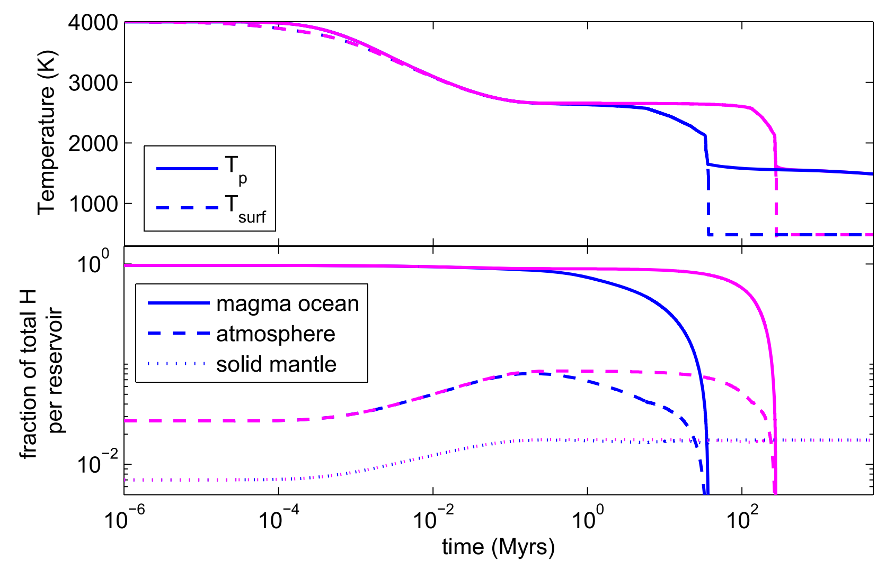
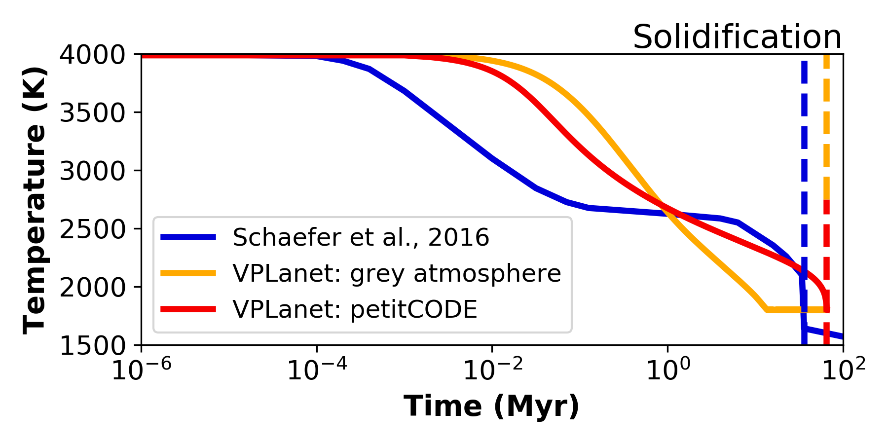

Validate MagmOc against `Schaefer et al. (2016) <http://stacks.iop.org/0004-637X/829/i=2/a=63?key=crossref.80f93f037970e1b0ba2e4e36e59ff5c1>`_
===========

Results for `Schaefer et al. (2016) <http://stacks.iop.org/0004-637X/829/i=2/a=63?key=crossref.80f93f037970e1b0ba2e4e36e59ff5c1>`_
taken from Fig. 4, upper panel (blue, solid line)
for GJ 1132b with 100 TO initial water content

This folder contains 2 subfolders for runs of `VPLanet`:

1) GJ_eps03_100TO_grey

    =============================   ===============
    **Planet name**                 GJ 1132b
    **Initial water content**       100 TO
    **Initial CO2 content**         0
    **XUV absorption efficiency**   0.3
    **Atmospheric flux model**      `grey atmosphere <https://doi.org/10.1016/j.epsl.2008.03.062>`_
    =============================   ===============

    To run this case:

    .. code-block:: bash

        vplanet vpl.in
        python plot_magmoc.py

    plot_magmoc.py will show results of individual run parameters in `Results_GJ1132b.png`

2) GJ_eps03_100TO_grey

    =============================   ===============
    **Planet name**                 GJ 1132b
    **Initial water content**       100 TO
    **Initial CO2 content**         0
    **XUV absorption efficiency**   0.3
    **Atmospheric flux model**      `petitCODE <http://stacks.iop.org/0004-637X/813/i=1/a=47?key=crossref.77a8d60f57f8167d4f171eed6bb4eba3>`_
    =============================   ===============

    Run this case the same way as scenario 1.

To create a plot comparing the potential temperature evolution of both cases to the results from
`Schaefer et al. (2016) <http://stacks.iop.org/0004-637X/829/i=2/a=63?key=crossref.80f93f037970e1b0ba2e4e36e59ff5c1>`_
type

.. code-block:: bash

    python Temp_GJ1132b_100TO.py

Expected output
---------------

