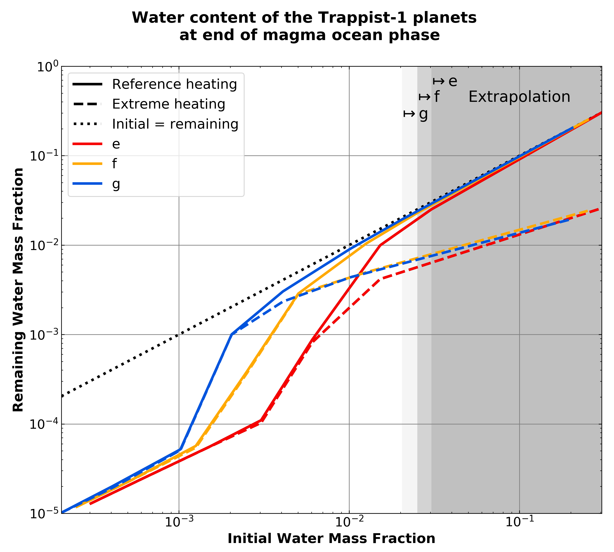

Comparison of final water fractions on TRAPPIST-1 e, f, and g
===========

Overview
---------------

In this plot, we compare the final water content of the planets TRAPPIST-1 e, f, g
with a pure steam atmosphere for different initial water mass fractions and
two different heating scenarios:
  - Reference: Earth abundances of radioactive isotopes and low eccentricities
  - Extreme: 1000 times Earth abundance of 40K and fixed eccentricities (e = 0.1)
For initial water fractions >20-30 wt% we extrapolate on the assumption
that solidification times do not increase with more water.
We compare our results to probability distributions of the current estimates for
water content of the TRAPPIST-1 planets by Dorn et al. (2018) and those calculated
with the interior structure model by Noack et al. (2016, this study) with 1σ error
range for mass and radius.

To run this case:
---------------

Each subfolder contains the necessary files to run `VPLanet`/**MagmOc** for
TRAPPIST-1 e, f, and g for 1 TO initial water mass for the reference heating and
the extreme heating (_heat).
To create the summary plot shown below:
  - copy the folders and change the initial water mass to 2, 5, 10, 20, 50, and 100 TO.
  - run the simulations in each folder and print the results as follows:

.. code-block:: bash

    vplanet vpl.in
    python print_results.py

The results will be saved in a file `Results.dat` in each folders.
Do

.. code-block:: bash

    python combine_results.py

to combine all results in six files `Results_Trappist1_e.txt`, `_f.txt`, `_g.txt`,
`_e_heat.txt`, `_f_heat.txt`, and `_g_heat.txt`.

Produce plots:
---------------

The figure in the paper is made up of three plots which will be produced by
executing the following scripts:

.. code-block:: bash

    python TR1_Water_Final.py
    python TR1_Water_Frac_Dorn.py
    python TR1_Water_Frac_Noack.py

Expected output
---------------

These plots can then be combined to the figure shown in the paper:

