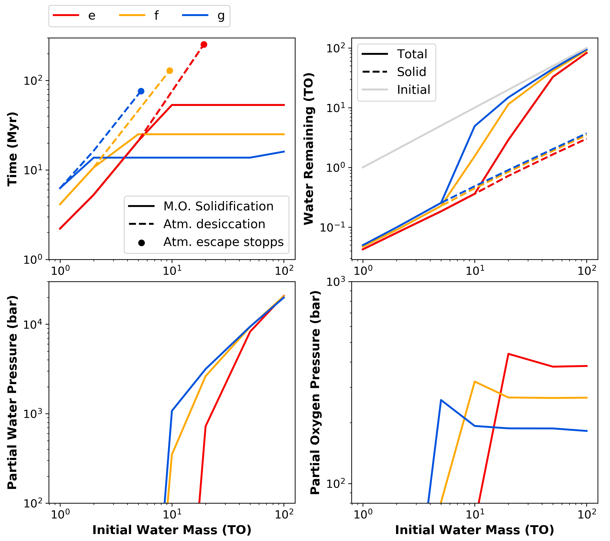

Magma ocean evolution on TRAPPIST-1 e, f, and g
===========

Overview
---------------

Overview of the simulation results for the magma ocean and atmosphere evolution
on the planets TRAPPIST-1 e, f, and g for initial water masses from 1-100 TO.
  - Top left: time of magma ocean solidification, atmospheric desiccation, and atmospheric escape stopp
  - Top right: remaining water mass in total system and in the solid mantle
  - Bottom left: partial water pressure at end of simulation
  - Bottom right: partial oxygen pressure at end of simulation

To run this case:
---------------

Each subfolder contains the necessary files to run `VPLanet`/**MagmOc** for
TRAPPIST-1 e, f, and g for 1 TO initial water mass.
To create the summary plot shown below:
  - copy the folders and change the initial water mass to 2, 5, 10, 20, 50, and 100 TO.
  - run the simulations in each folder and print the results as follows:

.. code-block:: bash

    vplanet vpl.in
    python print_results.py

The results will be saved in a file `Results.dat` in each folders.
Do

.. code-block:: bash

    python combine_results.py
    python summary_plot.py

to combine all results in three files `Results_Trappist1_e.txt`, `_f.txt`, and `_g.txt`,
and to print the summary plot `Summary_Trappist1.png`.

Expected output
---------------

