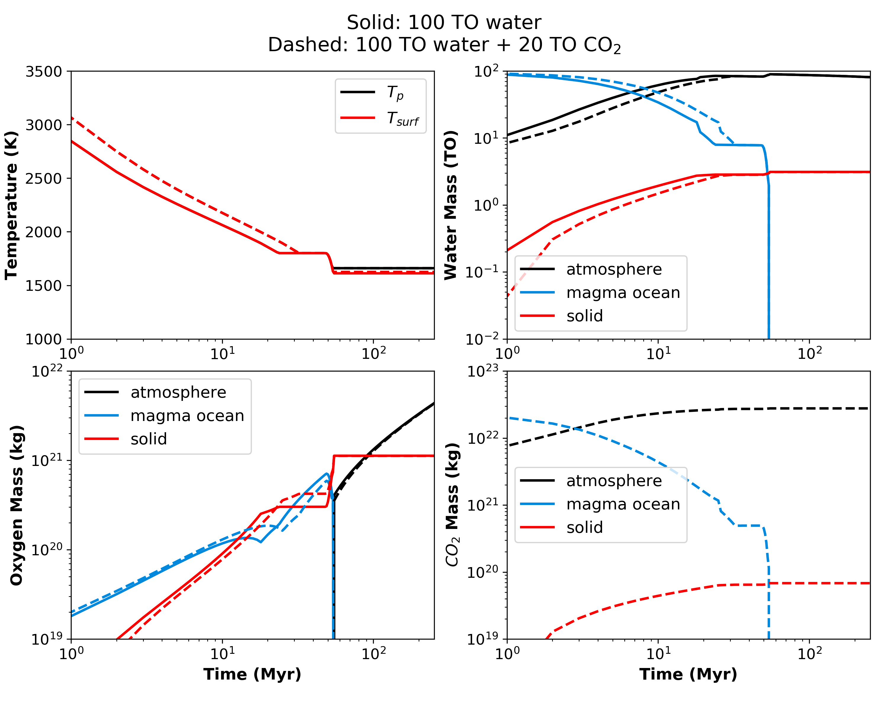

Magma ocean evolution on TRAPPIST-1 e w/ \& w/o CO2
===========

Overview
---------------

Evolution of the temperature and volatile budgets on TRAPPIST-1 e for 100 TO
initial water. One case includes 20 TO of CO2.

1) Without CO2:

    See folder `TR1_e_100TO` and run simulation:

    .. code-block:: bash

        vplanet vpl.in

2) With CO2:

    See folder `CO2_TR1_e_100TO` and run simulation:

    .. code-block:: bash

        vplanet vpl.in

Expected output
---------------

