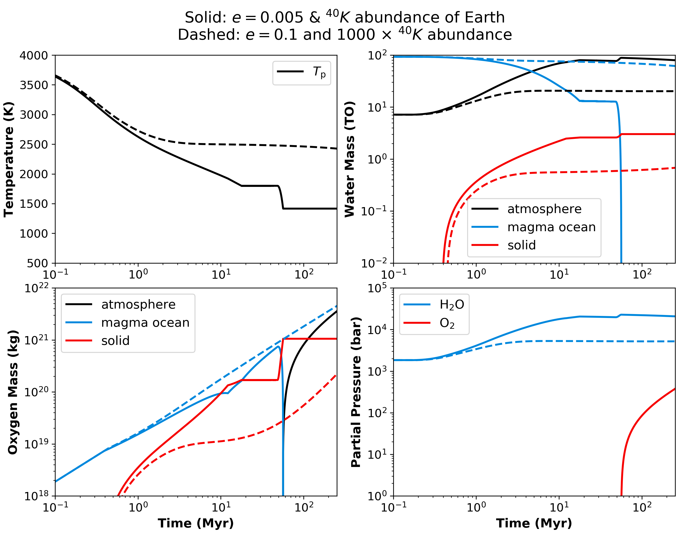

Magma ocean evolution on TRAPPIST-1 e for different heating scenarios
===========

Overview
---------------

Evolution of the temperature and volatile budgets on TRAPPIST-1 e for 100 TO
initial water and 20 TO initial CO2 content, for two different heating scenarios:

1) Reference Heating:

    Low tidal heating through low eccentricity (e = 0.005) and low radiogenic
    heating through Earth's abundance of 40K in the mantle.
    See folder `CO2_TR1_e_100TO` and run simulation:

    .. code-block:: bash

        vplanet vpl.in

2) Extreme Heating:

    High tidal heating through large eccentricity (e = 0.1) and high radiogenic
    heating through 1000 times Earth's abundance of 40K in the mantle.
    See folder `CO2_TR1_e_100TO_heat` and run simulation:

    .. code-block:: bash

        vplanet vpl.in

Expected output
---------------

