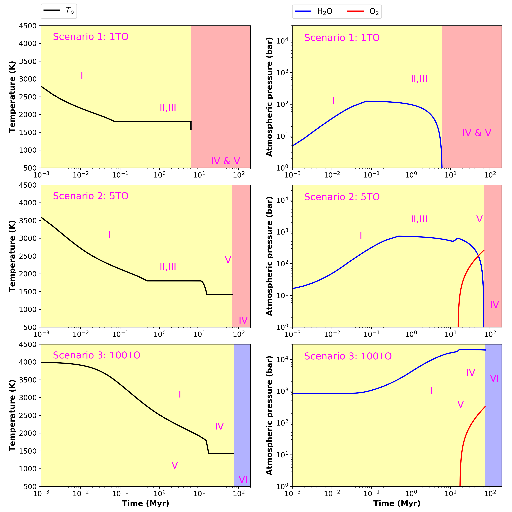

Magma ocean evolution on TRAPPIST-1 g
===========

Overview
---------------

Solidification time of the magma ocean and desiccation time of the atmosphere
of TRAPPIST-1 g for initial water masses from 1-100 TO without CO2.
Evolution plots for three different scenarios are shown in a second plot.

To run this case:
---------------

Each subfolder contains the necessary files to run `VPLanet`/**MagmOc** for
TRAPPIST-1 g for different initial water masses.
To create the summary plot shown below, run the simulations and print the results
in each folder as follows:

.. code-block:: bash

    vplanet vpl.in
    python print_results.py

The results will be saved in a file `Results.dat` in each folders.
Do

.. code-block:: bash

    python combine_results.py
    python TR1_scenarios_efg.py
    python TR1_scenarios_evolution.py

to combine all results in three files `Results_Trappist1_e.txt`, `_f.txt`, and `_g.txt`, and to print
the summary plot `Summary_Trappist1_scenarios_efg.png` and the temperature and
pressure evolution for the three scenarios.

Expected output
---------------

.. figure:: Summary_Trappist1_scenarios_efg.png
   :width: 600px
   :align: center

