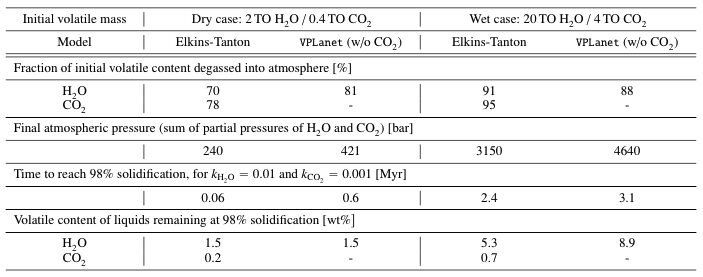

Validate MagmOc against `Elkins-Tanton (2008) <https://doi.org/10.1016/j.epsl.2008.03.062>`_
===========

Overview
--------

Simulation of the magma ocean and atmosphere evolution for Earth containing 2TO and 20TO
water compared to results presented by
`Elkins-Tanton (2008) <https://doi.org/10.1016/j.epsl.2008.03.062>`_
in their Table 3: Earth, initial magma ocean depth 2000 km.

To run this case:
-------------------

Each subfolder contains the necessary files to run `VPLanet`/**MagmOc** for
Earth for different initial water masses.
To create the summary table shown below, run the simulations and print the results
in each folder as follows:

.. code-block:: bash

    vplanet vpl.in
    python print_results.py

The results will be saved in a file `Results.dat` in each folders.
The final table shows the results from above simulations and the results from
`Elkins-Tanton (2008) <https://doi.org/10.1016/j.epsl.2008.03.062>`_, Table 3.

Expected output
---------------

